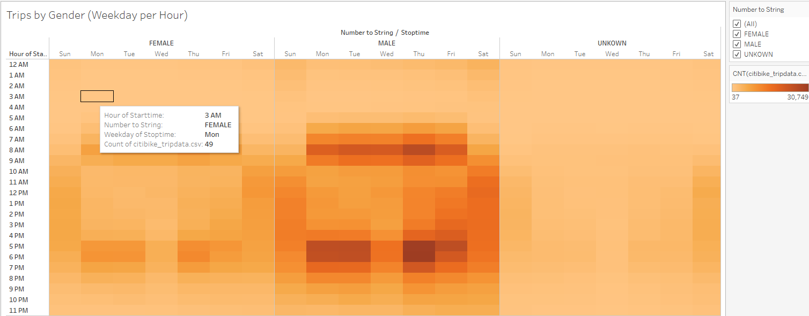

# Bike-Sharing

# Overview
Evaluate a bike-share business in the city of New York in order to visualize a proposal to implement the project in the city of Des Moines, Iowa. 

# Results

### Checkout Times for Users

The visualization shows that the bikes are checking out at the most between 4 and 6 hours of use with a peak count around 3,000 bikes in the hour five.

### Checkout Times by Gender

The visualization shows that the bikes are checking out at the most between 4 and 6 hours. The quantity is higher for the male gender with a peak count around 2,100 around hour five. The female gender has a lower use with a peak count around 740 in the same hour, and a gender classified as unknown has a use around 200 bikes in the same hour, although this classification has a constant counting during all hours of use.

### Trips by Weekday for Each Hour

This heat map shows that the most demanding time during the day for bike trips is in the mornings from 6 am and 9 pm and in the evening between 5 pm and 7 pm. It also shows that the Fridays, Saturdays, and Sundays are the busiest days with a total count over 20,000 bikes per day per each hour from 10 am to 7 pm.

### Trips by Gender (Weekday per Hour)

This heat map shows that the most demanding time during the day for bike trips is in the mornings from 6 am and 9 pm and in the evening between 5 pm and 7 pm. It also shows that the male gender is the most demanding mean while the female gender uses less quantity of bike trips.

### User Trips by Gender by Weekday

This heat map shows that the subscriber category has the most bike trips, and the male gender is using the bike trips in a greatest proportion during the week. 

### August Peak Hours

This visualization shows the peak hours during the month of August and the most active time is from 8 am through 9am in the mornings and from 4 pm through 7 pm in the evenings. 

### Total Number of Riders

This dashboard shows a total of 2,344,224 riders during the month of August in 2019. Also is showing the average of trip duration by birth year, a breakdown by gender and a map with locations when is more popular the bike-sharing model.
# Summary
The bike-sharing business model in the city of New York is clearly a successful model which can be replied in the city of Des Moines, Iowa. As a result of this analysis the visualizations indicate that a good quantity of bikes is needed to supply the demand in the city of New York. The model is focus on any age an any gender, but the evaluation shows that male gender and young people prefer to use the service. As a result, the subscribers' category is an attractive model of business that ends in a profitable structure when all those numbers of trips, bikes, and rides are going to be translated into a economic estimation.

[NYC Bike Dashboard](https://public.tableau.com/profile/daniel4500#!/vizhome/CityBikeRides/NYCStory?publish=yes)

[Bike-Sharing in NVC](https://public.tableau.com/profile/daniel4500#!/vizhome/citibike_16033370574920/Story1?publish=yes)

